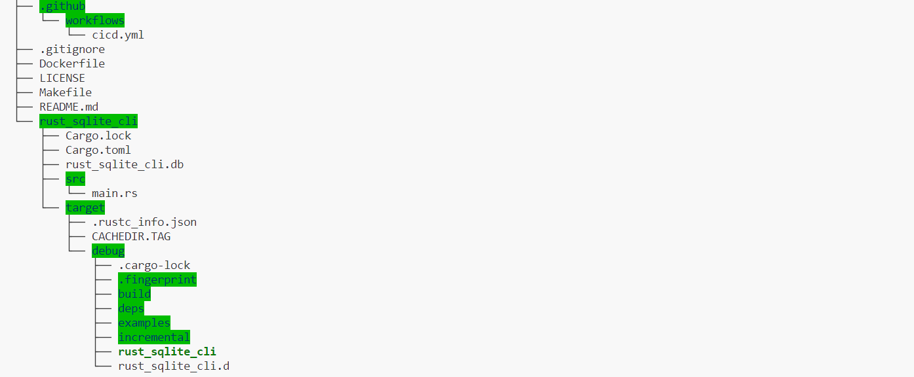
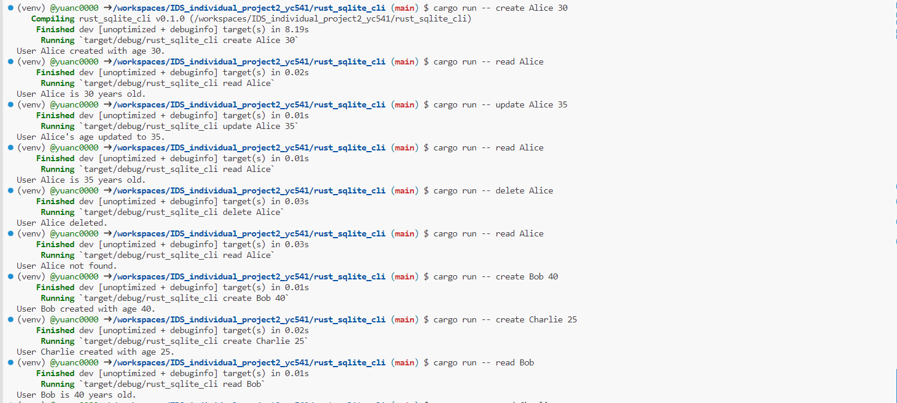
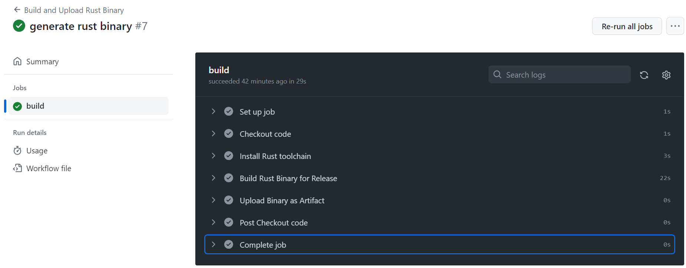

# Rust CLI Binary with SQLite

## Table of Contents

- [Project Structure](#project-structure)
- [Rust Source Code](#rust-source-code)
- [SQLite Database](#sqlite-database)
- [Use of GitHub Copilot](#use-of-github-copilot)
- [Optimized Rust Binary](#optimized-rust-binary)
- [How to Run the Project](#how-to-run-the-project)
- [GitHub Actions Results](#github-actions-results)
- [Demo Video](#demo-video)

## Project Structure

This project consists of several primary components:

#### `rust_sqlite_cli` Directory

- **Directory Overview**: `rust_sqlite_cli` is the primary directory of this project, encompassing all files and sub-directories related to the Rust application.
  
- **Cargo Configuration**: This directory includes `Cargo.toml` and `Cargo.lock`, which are pivotal in defining and tracking dependencies for the Rust project.
  
- **Source Code**: The main source code file is `main.rs`, situated under `rust_sqlite_cli/src/`. This constitutes the core code for the CLI application.

- **Database File**: `rust_sqlite_cli.db` is the SQLite database file used to store user data.

#### Binary Files

- **Binary Overview**: The resultant compiled project is a binary named `rust_sqlite_cli`.
  
- **Location**: This binary can be located in either the `target/debug/` or `target/release/` directory, contingent upon the build type (debug or release).

#### GitHub Workflows

- **cicd.yml Overview**: Located under `.github/workflows`, the `cicd.yml` file orchestrates the GitHub Actions for Continuous Integration and Continuous Deployment.

## Rust Source Code

The provided Rust code implements a command-line interface (CLI) for SQLite database operations. The application utilizes key crates and functions to achieve its functionality:

### Crates Utilized:

- **`clap`**: Used for CLI argument parsing. It provides an efficient way to handle command-line arguments and subcommands, offering a user-friendly interface for the CLI application.
- **`rusqlite`**: Interfaces with SQLite databases, allowing the application to execute SQL queries and interact with SQLite data.

### Main Functions:

- **`main`**: This is the entry point for the application. It initializes the CLI commands and subcommands (create, read, update, delete) and handles their execution based on user input.

- **`establish_connection`**: Establishes a connection to the SQLite database (`rust_sqlite_cli.db`). It returns a connection object or an error.

- **`init_db`**: Initializes the database by creating the `user` table if it doesn't already exist. The table has columns for id, name, and age.

- **`create_user`**: Inserts a new user into the `user` table with a specified name and age. It checks if the operation was successful and informs the user accordingly.

- **`read_user`**: Queries the `user` table for the age of a specified user and prints the result. If the user is not found, it informs the user.

- **`update_user`**: Updates the age of a specified user in the `user` table. It verifies if the update was successful and provides feedback to the user.

- **`delete_user`**: Deletes a specified user from the `user` table. It checks if the deletion was successful and informs the user.

Each function is designed to handle potential errors gracefully, either by providing feedback to the user or returning a Result type for further error handling.

## SQLite Database

After setting up the Rust project, you can use the following commands to interact with the SQLite database:

- `cargo run -- create`
- `cargo run -- read`
- `cargo run -- update`
- `cargo run -- delete`

**Database File**: The application utilizes an SQLite database file named `rust_sqlite_cli.db`. This file stores the user data and resides in the main directory of the `rust_sqlite_cli` project. All operations executed via the CLI commands interact directly with this database file, ensuring data persistence across application runs.

Below is a screenshot of the interactions results:

## Use of GitHub Copilot

This project, originally written in Python, was successfully transitioned to a Rust project with the indispensable help of GitHub Copilot. GitHub Copilot is an AI pair programmer powered by OpenAI’s GPT-3 model. It suggests entire lines or blocks of code as you type, helping developers write code faster and with fewer errors.

1. **Installation**: Installed the GitHub Copilot extension for Visual Studio Code, involving a visit to the Visual Studio Code marketplace and adding the Copilot extension.
2. **Configuration**: Connected it to my GitHub account to gain access to the AI-driven code suggestions. 
3. **Usage**: As embarked on transitioning the Python code to Rust, Copilot frequently provided code suggestions. These weren't just simple line completions but entire function blocks, ensuring the Rust idioms and best practices were maintained. This was particularly useful in areas where my familiarity with Rust was limited.
4. **Command Line Tools**: When crafting the Makefile for command-line tools, Copilot again was an invaluable resource. It proposed command structures, dependencies, and even error handling mechanisms that I might not have considered.
5. **Learning**: Beyond just providing code, Copilot served as a learning tool. By analyzing its suggestions, I gained insights into Rust’s best practices and deepened my understanding of the language's nuances.

Throughout the development process, GitHub Copilot was more than just a tool—it was like having an expert Rust developer guiding me every step of the way. The resulting code was more efficient, readable, and maintainable, thanks to the combined efforts of human intuition and AI-powered insights.

## Optimized Rust Binary

To generate an optimized Rust binary, there are two main approaches:

1. **Using `cargo build --release`**: This command manually builds an optimized Rust binary on your local machine. Running this command will place the optimized binary under the `target/release/` directory.
2. **Using GitHub Actions**: GitHub Actions offer a method to automate your build and release process. In the provided GitHub Actions configuration, an optimized Rust binary is automatically built on GitHub servers upon a push to the "main" branch and uploaded as a downloadable artifact.

Thus, both methods aim to generate an optimized Rust binary, but they serve different purposes and contexts:
- `cargo build --release` is for manual local builds.
- GitHub Actions are for automated builds and releases, allowing others (or yourself) to directly download the binary from GitHub.

For the assignment's requirements, using GitHub Actions satisfies the criteria of generating an optimized Rust binary as a downloadable GitHub Actions artifact.

## How to Run the Project

1. Before running the project, ensure you have Rust and Cargo installed. Install dependencies by navigating to the `rust_sqlite_cli` directory and running `cargo build`.
2. Use the `cargo run` command followed by the desired subcommand (e.g., `create`, `read`, `update`, `delete`).

## GitHub Actions Results

The `cicd.yml` file handles the automation for building and releasing the Rust binary. Upon successful builds, a green checkmark will appear in the GitHub Actions tab.

## Demo Video
Here is a sharing link to my demo video for this project.

https://www.loom.com/share/33063e2ca395483ba77e7194185b8925?sid=963267f4-1f08-4220-a672-bcc06e79cd59